👋 Hi, I'm Ananthu Jayakumar

  

  
  
  

  

🚀 About Me

I'm a Software Engineer & AI Engineer focused on building practical systems using software engineering, artificial intelligence, automation, data, and enterprise integrations.

I enjoy turning real-world problems into reliable engineering workflows:

        💡 Problem
            ↓
       🔍 Understand
            ↓
       🏗️ Design
            ↓
        💻 Build
            ↓
       ⚙️ Automate
            ↓
       📈 Improve

💡 Areas I Enjoy

🤖 Artificial Intelligence & LLM Applications

🧠 AI Agents & Tool-Using Systems

⚙️ Business Process Automation

🔗 Enterprise System Integrations

🐍 Python Development

🏗️ Software & Solution Architecture

📊 Data Processing & Transformation

🧪 AI-assisted Testing & Developer Tools

🌐 Backend & API Development

🧰 Tech Stack

🤖 AI / Machine Learning

  

LLMs · RAG · AI Agents · Prompt Engineering · Embeddings · Vector Search · MCP

💻 Software Engineering

  

REST APIs · Backend Development · System Design · Data Processing

🗄️ Databases & Data

  

☁️ Tools & Platforms

  

🧠 What I'm Interested In

<table>
<tr>
<td width="33%" align="center">

🤖 AI Engineering

LLMs
AI Agents
RAG
MCP
Tool Calling
AI Workflows

</td>

<td width="33%" align="center">

⚙️ Automation

Business Automation
Developer Productivity
Testing Automation
Workflow Automation

</td>

<td width="33%" align="center">

🏗️ Software Engineering

APIs
System Design
Architecture
Integrations
Data Processing

</td>
</tr>
</table>

🔥 What I'm Building

🤖 AI-Powered Engineering Solutions

I'm interested in using AI to improve real software development workflows.

Requirements
      ↓
   AI Analysis
      ↓
Structured Understanding
      ↓
Engineering Artifacts
      ↓
Human Validation
      ↓
     Automation

Examples include:

Requirements → User Stories

Requirements → Test Cases

Manual Test Cases → Automation Test Cases

AI-assisted Development

Engineering Productivity

🔗 Enterprise Integration

Working with systems that move and transform information across different platforms.

             ┌──────────────┐
             │    SOURCE    │
             └──────┬───────┘
                    ↓
             ┌──────────────┐
             │   EXTRACT    │
             └──────┬───────┘
                    ↓
             ┌──────────────┐
             │  TRANSFORM   │
             └──────┬───────┘
                    ↓
             ┌──────────────┐
             │   PROCESS    │
             └──────┬───────┘
                    ↓
             ┌──────────────┐
             │ DESTINATION  │
             └──────────────┘

Connect → Transform → Automate → Deliver

🧪 Currently Exploring

                         🧠 AI ENGINEERING
                                │
              ┌─────────────────┼─────────────────┐
              ↓                 ↓                 ↓
            🤖 LLMs           🧩 Agents          🔎 RAG
              │                 │                 │
              ↓                 ↓                 ↓
        Context Mgmt       Tool Calling       Retrieval
              │                 │                 │
              ↓                 ↓                 ↓
         Evaluation             MCP          Vector Search
              │                 │                 │
              └─────────────────┼─────────────────┘
                                ↓
                     🚀 Production AI Systems

I'm particularly interested in how AI can become a software engineering capability rather than simply a chatbot interface.

# 📊 GitHub Stats

  
  

  
  

🐍 Contribution Animation

  <picture>
    <source media="(prefers-color-scheme: dark)" srcset="https://raw.githubusercontent.com/ananthu666/ananthu666/output/github-contribution-grid-snake-dark.svg">
    <source media="(prefers-color-scheme: light)" srcset="https://raw.githubusercontent.com/ananthu666/ananthu666/output/github-contribution-grid-snake.svg">
    
  </picture>

🧩 My Engineering Approach

                 ┌───────────────────┐
                 │      PROBLEM      │
                 └─────────┬─────────┘
                           ↓
                 ┌───────────────────┐
                 │    UNDERSTAND     │
                 └─────────┬─────────┘
                           ↓
                 ┌───────────────────┐
                 │      DESIGN       │
                 └─────────┬─────────┘
                           ↓
                 ┌───────────────────┐
                 │       BUILD       │
                 └─────────┬─────────┘
                           ↓
                 ┌───────────────────┐
                 │     AUTOMATE      │
                 └─────────┬─────────┘
                           ↓
                 ┌───────────────────┐
                 │      IMPROVE      │
                 └───────────────────┘

Good engineering is not about using the most technology.
It's about solving the right problem with the right technology.

🎯 What I Like Working On

<table>
<tr>
<td align="center">🤖 <b>AI Engineering</b></td>
<td align="center">⚙️ <b>Automation</b></td>
</tr>
<tr>
<td align="center">🔗 <b>Enterprise Integrations</b></td>
<td align="center">🏗️ <b>System Architecture</b></td>
</tr>
<tr>
<td align="center">🐍 <b>Python Development</b></td>
<td align="center">🧠 <b>LLM Applications</b></td>
</tr>
<tr>
<td align="center">📊 <b>Data Processing</b></td>
<td align="center">💻 <b>Developer Productivity</b></td>
</tr>
</table>

📌 A little more about me

 

💻 I enjoy working on

Complex engineering problems

AI-powered applications

Backend systems

API integrations

Automation

Data transformation

Enterprise workflows

System architecture

Developer productivity

🧠 Currently improving

Data Structures & Algorithms

System Design

AI Engineering

LLM Applications

AI Agents

Backend Architecture

Production-ready AI systems

🌐 Let's Connect

  <i>Building systems, learning continuously, and exploring what's possible with AI.</i>

  

